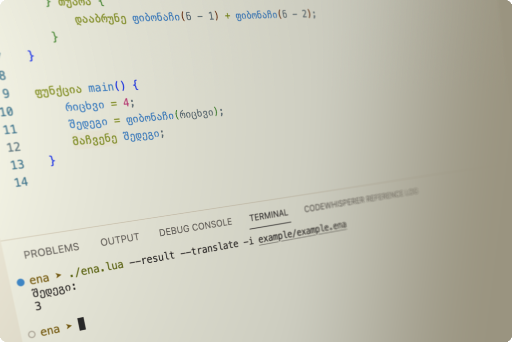

# Final Project Report: Ena

<p align="center">
  
</p>

This language aims to make programming more accessible for Georgians by allowing them to write code in their native language.
Ena uses the syntax of popular, widely-used languages, modified to use the Georgian alphabet and keywords.

## Language Syntax

The overall syntax of the language follows Selene, the language that Roberto builds throughout the course.
I allowed the use of English keywords and syntax to simplify the evaluation process for this project.

<table>
  <tr>
    <th>English</th>
    <th>Georgian</th>
  </tr>
  <tr>
    <td>
      <pre>
      <code>
function factorial(n = 6) {
    if n != 0 {
        return n * factorial(n - 1)
    } else {
        return 1
    }
}
function main() {
    return factorial()
}
        </code>
        </pre>
    </td>
    <td>
      <pre>
  <code>
ფუნქცია ფაქტორიალი(ნ = 6) {
    თუ ნ != 0 {
        დააბრუნე ნ * ფაქტორიალი(ნ - 1)
    } თუარა {
        დააბრუნე 1
    }
}
ფუნქცია main() {
    დააბრუნე ფაქტორიალი()
}
  </code>
  </pre>
    </td>
  </tr>
</table>

You can check the [tests](./ena/spec/e2e.lua) for more examples. You can run all the tests with `$ ena --tests` command.

Execute the [input.ena](./example/input.ena) for the input program. `input.ena` has comments to explain the syntax briefly.

Check out the new [sysinfo.ena](./example/sysinfo.ena) program that shows various system informations for Linux and Darwin os.

## New Features

The design choices remain consistent with the principles discussed in the lectures and exercises,
adhering to established best practices and prioritizing simplicity in the syntax of common programming languages.

An additional feature is the transpiler option, which allows for the conversion of Ena code into Lua code.
This enables users to visualize how the Ena code would appear in widely recognized programming languages.
Additionally, the Lua code can be further transpiled into languages such as Python, Typescript, and more.

In addition to the transpiler capability, I have introduced several new features to the system:
- Booleans,
- Abscence of value (nil)
- String literals (with concatenation, use `+` sign)
- Shell execution (with `$` operator)

## Installation
1. Install [Lua](https://www.lua.org/start.html#installing) and [LuaRocks](https://github.com/luarocks/luarocks/wiki/Download)
2. Install Ena with LuaRocks - `$ luarocks install ena`
3. (optional) Install VS Code [Extension](https://marketplace.visualstudio.com/items?itemName=pgagnidze.ena) for syntax highlighting

## Usage
We can run Ena with:

`$ ena -i [filename] [options]`

options are:

| Option | Short form | Description |
|--------|------------|-------------|
| --help | -h | Show this help message. |
| --input | -i | Specify the input file. |
| --ast | -a | Show abstract syntax tree. |
| --code | -c | Show generated code. |
| --trace | -t | Trace the program. |
| --result | -r | Show the result. |
| --pegdebug | -p | Run the PEG debugger. |
| --transpile | -tp | Transpile to Lua. |
| --translate | -tr | Translate messages to Georgian. |

For example:
`$ ena --result --transpile -i example/example.ena`

```
Result:
720

Transpiled:
function faqtoriali(n)
    n = n or 6
    if n ~= 0 then
        return n * faqtoriali(n - 1)
    else
        return 1
    end
end
function main()
    return faqtoriali()
end

main()
```

## Future
> What would be needed to get this project ready for production?

To prepare this project for production, I would add modules, for loops, and dictionaries.
These additions would allow for easier resolution of various algorithmic challenges and enhance the overall functionality of the project.

I have one concern that arises during the transpilation process, which is the difference in reserved words between Ena and Lua. Certain words reserved in Ena may have different meanings or uses in Lua, and vice versa. This disparity can create challenges when converting Ena code into Lua code. One specific concern is when a user employs a keyword, not reserved in Ena, such as "end," as a variable. After transpilation, the converted code may assign a value to "end," leading to unexpected errors. To address this, it is crucial to handle such cases carefully and resolve conflicts between reserved keywords and user-defined variables appropriately during transpilation.

> How would you extend this project to do something more? Are there other features you’d like? How would you go about adding them?

To expand the capabilities of this project, my first step would be to focus on making the syntax more user-friendly and easily understandable for Georgian users.
Simultaneously, I would ensure that the language remains approachable for learning purposes.

Check out the [Issues](https://github.com/pgagnidze/ena/issues) for more details about the Ena roadmap.

## Self assessment
| Criteria | Score |
| -------- | -------- |
| Language Completeness  | 2  |
| Code Quality & Report| 2  |
| Originality & Scope| 2  |

> Have you gone beyond the base requirements? How so?
- Made the project available on Luarocks, a package manager for Lua, which simplifies the installation process for users.
- Added the CI/CD for the tests to ensure stability and quality.
- Developed a CLI (Command-Line Interface) tool that offers convenient options for users to interact with the project.
- Created a syntax highlighter specifically for Visual Studio Code, enhancing the code editing experience for users working with the project.
- Implemented the transpiler option, allowing the conversion of Ena code into Lua code, which enables users to evaluate and utilize the code in a more established programming language.

## References

- [Moonscript](https://github.com/leafo/moonscript)
- [Testing Lua projects with GitHub Actions](https://leafo.net/guides/testing-lua-modules-with-github-actions.html)
- [Mab programming language by Mark W. Gabby-Li](https://github.com/mwgabby-li/Mab)
- [Syntax Highlight Guide](https://code.visualstudio.com/api/language-extensions/syntax-highlight-guide)
