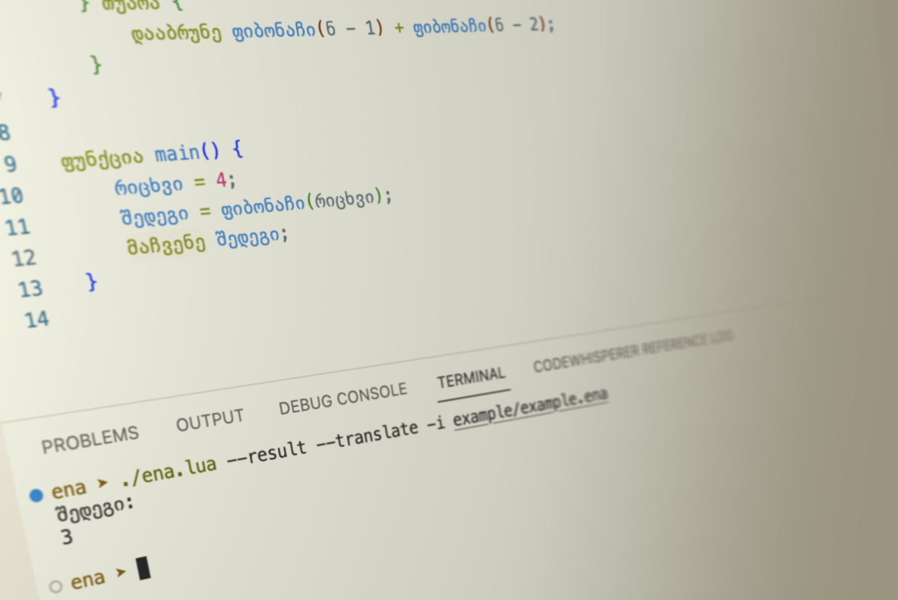

# ენა - Ena
<p align="center">
  
</p>

ენა მიზნად ისახავს, ქართველებისთვის ხელმისაწვდომი გახადოს პროგრამირება, რაც გულისხმობს მშობლიურ ენაზე კოდის წერას. ენა იყენებს პოპულარული, ფართოდ გავრცელებული ენების სინტაქსს, რაც დაგვეხმარება მარტივად შევისწავლოთ პროგრამული ენის მახასიათებლები.

## პროგრამული ენის მახასიათებლები
- საბაზისო ოპერაციები - არითმეტიკული ოპერატორები (+, -, *, /, %, ^), შედარებითი ოპერატორები (==, !=, <, >, <=, >=), ლოგიკური ოპერატორები (&, |), ერთიანი ოპერატორები (!, -).
- ცვლადები - გლობალური** და ლოკალური ცვლადების დეკლარაცია.
- if დებულებები და ციკლები - პროგრამის მიმართულებისა და ლოგიკის კონტროლი ცილკებისა და if დებულებების გამოყენებით. 
- მასივები - ახალი მასივების შექმნა, მასივის ელემენტებზე წვდომა და მნიშვნელობების მინიჭება.
- ფუნქციები - ფუნქციების შექმნა და გამოძახება.

## ინსტალაცია
1. დააინსტალირეთ [Lua](https://www.lua.org/start.html#installing) და [LuaRocks](https://github.com/luarocks/luarocks/wiki/Download)
2. გაუშვით შემდეგი ბრძანება ტერმინალში - `$ luarocks install ena`

## გამოყენება
ენა შეგვიძლია გავუშვათ ასე:

`$ ena -i [filename] [options]`

options-ები მოიცავს:

| ოფშენი | მოკლე ჩანაწერი | აღწერა |
|--------|------------|-------------|
| --input | -i | მიუთითეთ შესაყვანი ფაილი. |
| --ast | -a | აჩვენეთ აბსტრაქტული სინტაქსის ხე. |
| --code | -c | აჩვენეთ გენერირებული კოდი. |
| --trace | -t | მიჰყევით პროგრამის მსვლელობას. |
| --result | -r | აჩვენეთ შედეგი. |
| --pegdebug | -p | გაუშვით PEG დებაგერი. |
| --transpile | -tp | ტრანსპილაცია Lua-ში. |
| --translate | -tr | თარგმნეთ წერილები ქართულ ენაზე. |

## მაგალითი

```ena
ფუნქცია ფაქტორიალი(ნ = 6) {
    თუ ნ != 0 {
        დააბრუნე ნ * ფაქტორიალი(ნ - 1)
    } თუარა {
        დააბრუნე 1
    }
}

ფუნქცია main() {
    დააბრუნე ფაქტორიალი()
}
```

## კონტრიბუცია
თუ იპოვით შეცდომას, გსურთ შემოგთავაზოთ ახალი ფუნქცია ან გჭირდებათ დახმარება რაიმესთან დაკავშირებით, გთხოვთ გახსნათ ახალი მოთხოვნა GitHub Issue-ებში.

## ლიცენზია
ენა ლიცენზირებულია GPLv3 ლიცენზიით. დამატებითი ინფორმაცია იხილეთ LICENSE ფაილში.

## ♥
- Roberto Ierusalimschy-ის მიერ პროგრამირების ენის შემსწავლელი კურსის საბოლოო პროექტი
- Mark W. Gabby-Li-ის Mab პროგრამირების ენაზე დაფუძნებული
