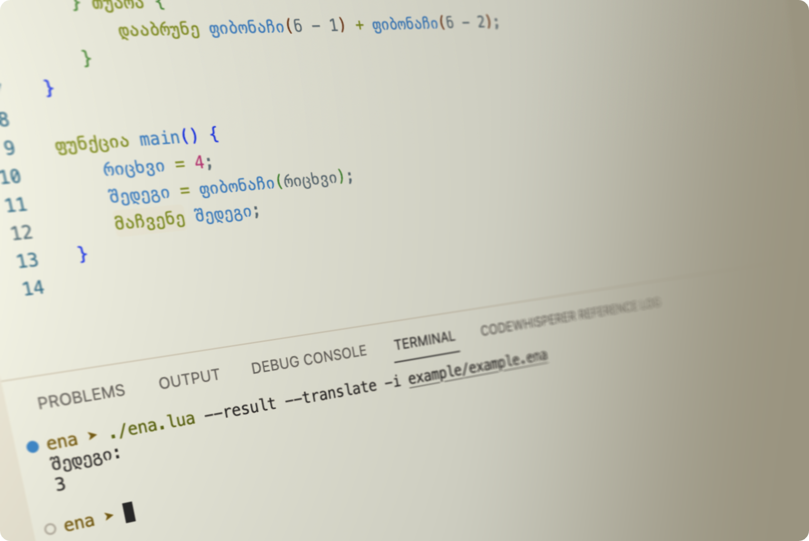

# ენა - Ena

  

ენა - ქართული პროგრამირების ენა.

ენა მიზნად ისახავს, ქართველებისთვის ხელმისაწვდომი გახადოს პროგრამირება, რაც გულისხმობს მშობლიურ ენაზე კოდის წერას. ენა იყენებს პოპულარული, ფართოდ გავრცელებული ენების სინტაქსს, რაც დაგვეხმარება მარტივად შევისწავლოთ პროგრამირების ენის მახასიათებლები.

***დეტალურ დოკუმენტაციას შეგიძლიათ გაეცნოთ ენას [დოკუმენტაციაში](https://doc.ena-lang.org/)***

## კონტრიბუცია

თუ იპოვით შეცდომას, გსურთ შემოგთავაზოთ ახალი ფუნქცია ან გჭირდებათ დახმარება რაიმესთან დაკავშირებით, გთხოვთ გახსნათ ახალი მოთხოვნა GitHub Issue-ებში.

## ლიცენზია

ენა ლიცენზირებულია GPL-3.0 ლიცენზიით. დამატებითი ინფორმაცია იხილეთ [LICENSE](https://github.com/pgagnidze/ena/blob/main/LICENSE) ფაილში.

## ♥

- Roberto Ierusalimschy-ის პროგრამირების ენის შემსწავლელი კურსის საბოლოო პროექტი ([Report](./NOTES.md))
- Mark W. Gabby-Li-ის [Mab](https://github.com/mwgabby-li/Mab) პროგრამირების ენაზე დაფუძნებული
